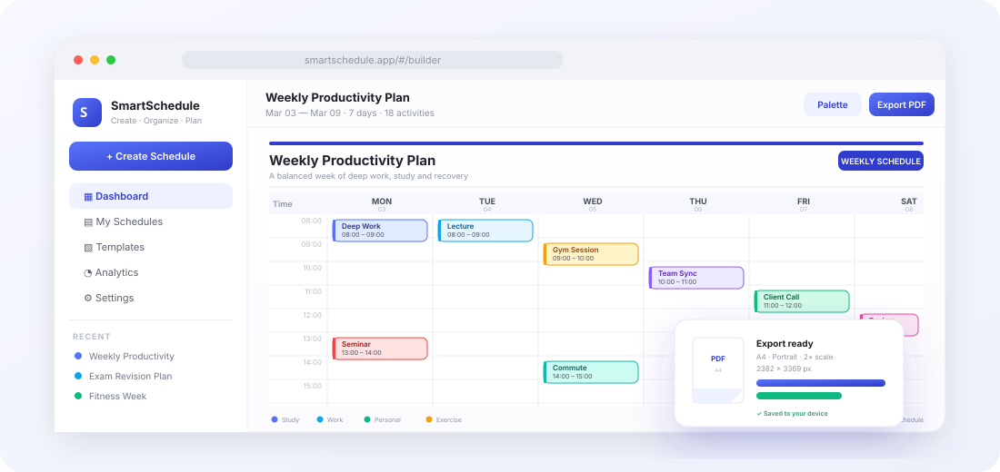
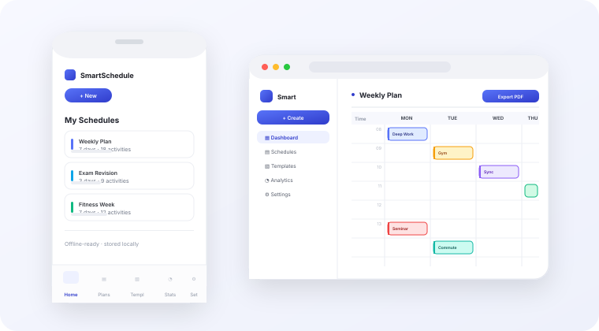

<p align="center">
  
</p>

<p align="center">
  <a href="https://100raav.github.io/smart-schedule/"></a>
  
  
  
  
  
</p>

<h1 align="center">SmartSchedule</h1>
<p align="center"><b>Create. Organize. Plan.</b> — a local-first schedule builder that turns free text into a beautiful, print-ready timetable.</p>

<p align="center">
  <a href="#-features">Features</a> ·
  <a href="#-screens">Screens</a> ·
  <a href="#-tech-stack">Stack</a> ·
  <a href="#-getting-started">Run it</a> ·
  <a href="#-deployment">Deploy</a> ·
  <a href="#author">Author</a>
</p>

---

## 📌 About

**SmartSchedule** is a zero-backend productivity web app for building timetable-style schedules — study plans, routines, fitness weeks, project trackers, shift rosters — and exporting them as **print-ready PDFs** or **wallpaper-ready images**.

- **Local-first** — everything is stored in your browser (IndexedDB). No account, no server, no tracking.
- **Offline-ready PWA** — installable, works with no network, caches for the next visit.
- **Smart input** — describe your week in plain language (`"Lecture 9-10 daily"`) and a deterministic parser turns it into real activities with categories, colours and repeats.
- **Professional output** — a document-style masthead, colour-coded categories, legend, and a branded footer. **What you see in the preview is exactly what lands in your PDF/PNG.**
- **Fast and small** — ~50 kB gzipped for the core app; the 3D hero scene is lazy-loaded only when the device supports WebGL.

---

## ✨ Features

<table>
<tr>
<td width="50%" valign="top">

**🗓️ Builder**
- Drag activities across days and time slots
- Resize from the bottom edge to change duration
- Double-click any empty slot to add, double-click a card to edit
- Overlap-aware track layout — side-by-side blocks never stack
- Undo / redo history, copy / paste between days
- Repeat rules: none, daily, weekdays, weekends, weekly

</td>
<td width="50%" valign="top">

**✨ Smart Scheduler**
- Free-text → structured activities
- Regex-driven time, duration, day and category detection
- Auto-generates the day span and time range
- Deterministic, offline, no API key, no cost

</td>
</tr>
<tr>
<td valign="top">

**🎨 Design system**
- 5 sheet styles: minimal, paper, professional, modern, notebook
- Font, size, weight, background, primary/secondary colour
- Compact / comfortable / spacious density
- Grid lines, legend, weekend and time-label toggles
- 9 built-in categories + custom ones
- 18 activity icons, 3 priority levels, optional location & notes

</td>
<td valign="top">

**📤 Export & print**
- **PDF** (A4 / A5 / Letter, portrait / landscape, multi-page)
- **PNG** and **JPG** at 2× / 3× / 4× scale
- **JSON** round-trip — export and re-import any schedule
- Paper size, orientation, zoom and quality controls in the preview
- Real pixel-dimension readout before you download
- Browser print stylesheet for a clean physical print

</td>
</tr>
<tr>
<td valign="top">

**📊 Library & analytics**
- Dashboard with 10 creation entry points
- Templates gallery (student, professional, personal, custom)
- Search, favourite, rename, duplicate, delete
- Storage usage estimate
- Analytics: totals, week chart, category donut, hourly distribution

</td>
<td valign="top">

**⌨️ Experience**
- Full keyboard shortcuts (`?` opens the list)
- Light / dark / system themes, 8 accent colours + custom picker
- 5-second hand-drawn boot animation (skipped for reduced motion)
- Toasts, confirm dialogs, autosave indicator
- Responsive from 320 px phones to ultrawide desktops
- Reminders via the Notification API

</td>
</tr>
</table>

---

## 🖼️ Screens

<p align="center">
  
</p>
<p align="center"><b>Builder with the professional sheet style and the export studio.</b></p>

<p align="center">
  
</p>
<p align="center"><b>Phone and tablet layouts — sidebar collapses, actions move to a bottom bar.</b></p>

---

## 🛠️ Tech Stack

| Layer | Choice |
| --- | --- |
| Framework | React 18 + TypeScript 5.6 |
| Build | Vite 5 |
| Styling | Tailwind CSS 3.4, CSS custom properties for theming |
| Animation | Framer Motion |
| 3D hero | React Three Fiber + three (lazy, WebGL-detected) |
| State | Zustand (+ IndexedDB persistence) |
| Export | html2canvas + jsPDF |
| Routing | React Router (HashRouter — GitHub Pages friendly) |
| Icons | lucide-react |
| PWA | Service worker, web app manifest |
| Quality | ESLint 9 (flat config), `tsc -b`, no unused locals/params |

---

## 🚀 Getting Started

**Requirements:** Node.js 18+ (tested on 20) and npm.

```bash
# 1. clone
git clone https://github.com/100raav/smart-schedule.git
cd smart-schedule

# 2. install
npm install

# 3. run in dev mode
npm run dev
```

Open <http://localhost:5173>. On first launch the app seeds a **"Weekly Productivity Plan"** demo schedule so there is something to look at immediately — delete it any time from **My Schedules**.

### Scripts

| Command | What it does |
| --- | --- |
| `npm run dev` | Vite dev server with HMR on port 5173 |
| `npm run build` | Type-check with `tsc -b`, then production build to `dist/` |
| `npm run preview` | Serve the production build locally (port 4173) |
| `npm run lint` | ESLint 9 over `.ts` / `.tsx`, zero warnings allowed |
| `npm run typecheck` | Type-check only |

---

## 🗂️ Project Structure

```
smart-schedule/
├── public/                 # PWA manifest, icons, service worker, .nojekyll
├── assets/                 # README artwork
├── .github/workflows/      # GitHub Pages deployment
├── src/
│   ├── main.tsx            # Bootstrap: theme, accent, boot loader, root render, SW
│   ├── App.tsx             # Routes, global shortcuts, reminder loop, overlays
│   ├── types/              # Domain model (Schedule, Activity, Settings…)
│   ├── utils/              # id, time, colour, schedule helpers
│   ├── services/           # db, settings, export, smartScheduler, notify, templates, json
│   ├── store/              # zustand: schedule (autosave), settings, ui
│   ├── hooks/              # useHistory (undo/redo)
│   ├── components/ui/      # Button, Modal, Toast, ConfirmDialog, ShortcutsModal, BootLoader
│   ├── layouts/            # AppLayout (sidebar + mobile nav)
│   └── features/
│       ├── landing/        # Marketing page + R3F hero scene
│       ├── dashboard/      # Create hub + My Schedules library
│       ├── templates/      # Template gallery
│       ├── builder/        # The editor
│       ├── scheduler/      # Grid, activity editor, smart panel, customizer, config
│       ├── preview/        # Export studio
│       ├── analytics/      # Charts and stats
│       └── settings/       # Preferences and storage
```

---

## ⌨️ Keyboard Shortcuts

| Key | Action |
| --- | --- |
| `N` | Add activity |
| `S` | Save now |
| `E` | Open preview & export |
| `Ctrl/⌘ + Z` | Undo |
| `Ctrl/⌘ + Shift + Z` / `Ctrl/⌘ + Y` | Redo |
| `Ctrl/⌘ + C` / `Ctrl/⌘ + V` | Copy / paste activity |
| `Delete` | Delete selected activity |
| `?` | Show the shortcuts panel |

---

## 🔒 Privacy

There is no backend. Schedules live in **IndexedDB** in your browser, settings in **localStorage**. Nothing is uploaded, no analytics are sent, no cookies are set. Clearing site data deletes everything — use **Export JSON** first if you want a backup.

---

## 🚀 Deployment

The app is deployed to GitHub Pages with a single push:

```bash
npm run build      # or let CI do it
git push           # .github/workflows/deploy.yml builds and publishes to Pages
```

Live at **<https://100raav.github.io/smart-schedule/>**

- `base: './'` in `vite.config.ts` keeps every asset path relative, so the build works on a project sub-path.
- Hash routing means deep links survive a hard refresh on static hosting.
- The workflow runs `typecheck → lint → build` before publishing, so a broken commit never reaches the live site.

---

## 👨‍💻 Author

**Saurav Bichha** — Computer Science & Engineering student and full-stack developer.

[](https://github.com/100raav)
[](https://www.linkedin.com/in/saurav-bixa/)
[](https://leetcode.com/u/100raav73/)
[](https://orcid.org/0009-0002-8578-2330)

---

## 🤝 Contributing

Issues and pull requests are welcome. Before opening one:

```bash
npm run lint && npm run typecheck && npm run build
```

Keep changes focused, match the existing code style, and describe the user-facing behaviour you changed.

## 📄 License

Released under the **MIT License**.
